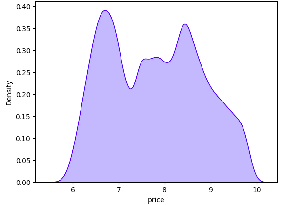
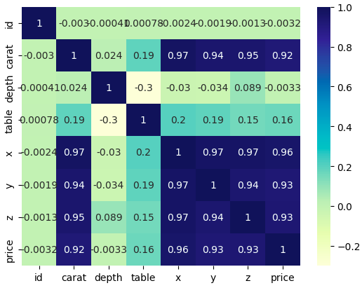
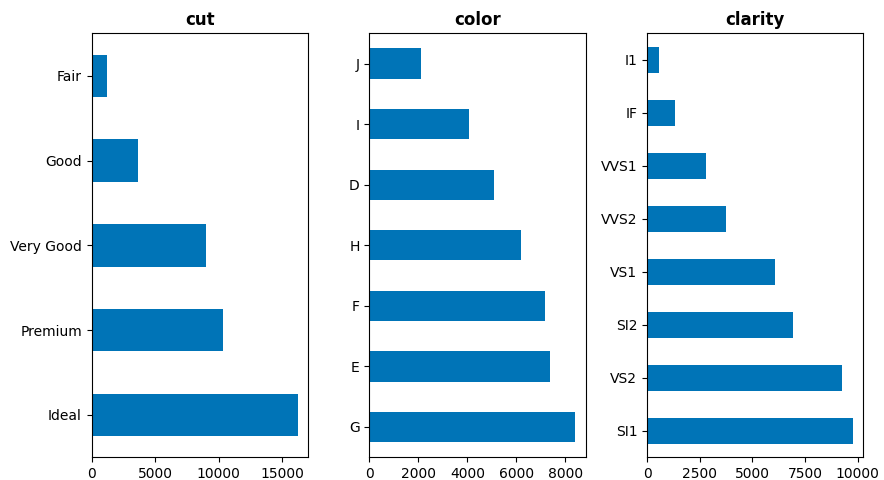
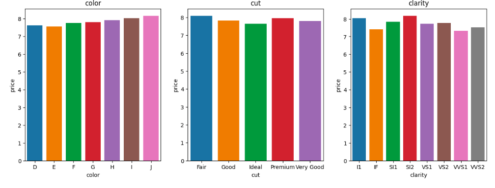
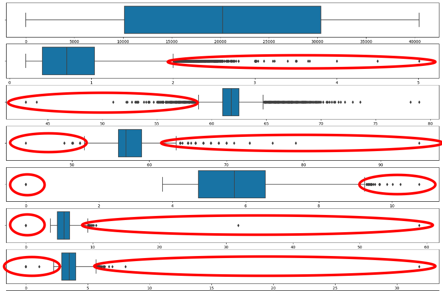
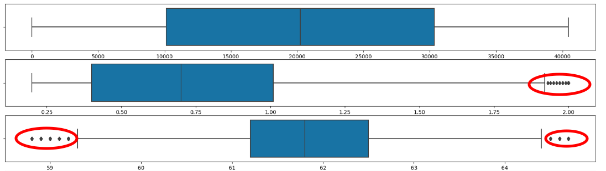
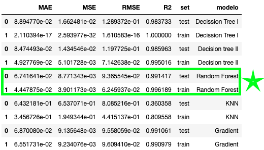

# Kaggle_competition_Diamonds_BG

## OBJECTIVE
---
Find the best machine learning model and params for a given dataset.

Find the Kaggle competition **diamonds-datamad1022-part** in the following [link](https://www.kaggle.com/competitions/diamonds-datamad1022/overview).

## Folders
----
[Data](hhttps://github.com/Belengasset/Kaggle_competition_Diamonds_BG/tree/main/data): *Contains the csv's with the data, the `train.csv`, `test.csv` and the `sample submission`*

[Notebook](https://github.com/Belengasset/Kaggle_competition_Diamonds_BG/tree/main/notebook): *I Each folder contains the files (Jupyter notebooks) where the code is and the `csv` generated for the submission.t's divided in submission folders.*
- [Submission1](https://github.com/Belengasset/Kaggle_competition_Diamonds_BG/tree/main/notebook/Submission%201)
- [Submission2](https://github.com/Belengasset/Kaggle_competition_Diamonds_BG/tree/main/notebook/Submission%202)
- [Submission3](https://github.com/Belengasset/Kaggle_competition_Diamonds_BG/tree/main/notebook/Submission%203)
- [Submission4](https://github.com/Belengasset/Kaggle_competition_Diamonds_BG/tree/main/notebook/Submission%204)

[Images](https://github.com/Belengasset/Kaggle_competition_Diamonds_BG/tree/main/images): *Contains the files (images) to insert in the jupyters*

## Description
----
The first part of the project consists of analyzing the train data. For this purpose, an exploratory analysis (EDA) has been carried out.

### *1. EDA*

#### *A. General Analysis*
In order to explore the data, we first analyze the variables in a general way, see if they have nulls and if there are duplicates.

We continue with an examination of the response variable.

#### *B. Predicted variables - Numerical variables*
We explore what are the main statistics of the numerical variables.
- with a visualisation of the distribution chart for each numerical variable
- with a graph of the relationship between predictor variables and the variable to be predicted
- we study the correlation of the numerical variables with a heatmap. As can be seen below, the correlation of the variables "carat", "x", "y" and "z" is very high. This must be taken into account when preparing our prediction model. As the "depth" variable is dependent on   variables "x", "y" and "z" in one of the models, we eliminate these variables. They can be redundant and are already used in the prediction through the "depth", total depth percentage = z / mean(x, y) = 2 * z / (x + y) (43--79).

#### *C. Predicted variables - Categorical variables*
We explore the categorical variables with a chart for each qualitative variable

We cannot draw major conclusions about these variables so we will take them all into account when forecasting. 

#### *D. Predicted variables - Management of Outliers]*
In order for outliers, which are outliers in our data, to affect our prediction model, we are going to deal with them. to do so, we use a function detect_outliers. 
First, we identify them visually with a boxplot. Secondly, with a function we detect the indexes with outliers, i.e. that are less than the value of Q1 - outlier_step and that are greater than the value of Q3 + outlier_step. 

Once I have them identified, in submission1 we replace the otliers with the median (the mean would not be a bad choice, it looks pretty close to the median). Despite replacing the outliers, new ones appear, so we eliminate those new ones. then in submissio2 the treatment is different, as all of the outliers are deleted.

### *2. What is the distribution of our data?*

Now we need to analyze the distribution of our data to see if we should normalize and standardize. We apply he Shapiro test. In the case of ShapiroResult(statistic=0.9629329442977905, pvalue=0.0), the p-value is zero, which means that there is significant evidence to reject the null hypothesis that the data follow a normal distribution. Therefore, it is concluded that the data do not follow a normal distribution.

We are going to standardize, i.e. change the values of our columns so that the standard deviation of the distribution equals one and the mean equals 0. We use the **StandardScaler()** method. It is a sklearn method. It standardizes a characteristic by subtracting the mean and dividing all values by the standard deviation. Then, we adjust our data with `.fit` and save it in a pickel to be able to apply it later in the prediction.

### *3. ENCODING*

To encode the 3 categorical variables we will use 2 methods, Label enconding and Ordinal enconding.
In the firsts submissions we apply the label enconding which is more generic and we do not apply a specific order. However, in the submission 4 we try to see the importance of the variables and how they affect the response variable. Some are not much more important than others, but when it comes to coding, it can guide us as to the weight we can give to each one, applying the Ordinal Encoder. Likewise I will apply here the encoding in the test data and save the data in a csv.

### *4. ADJUSTMENT OF THE MODEL*

#### *A. Separation of test-train*
Evaluating the predictive capacity of a model consists of checking how close its predictions are to the true values of the response variable, i.e. comparing the predicted values with the real ones.
For this purpose, the available data are partitioned into a training set and a test set. The appropriate size of the partitions depends on the amount of data available and the required confidence in the error estimation, we will choose 80%-20% as it usually gives good results.

It is important to verify that the distribution of the response variable is similar in the training and test set. We will do this by exploring each of the splits we made with `.describe()`.

Once we have the data separated we will apply the models to the continous variable "price".

#### *B. Modelization*

    a. Decision tree
The method we apply is the **DecisionTreeRegressor**. It's a decision tree algorithm where the goal is to predict the price of the diamond (continuous numerical value). The algorithm works by recursively splitting the input data into smaller subsets based on the values of the input features until a stopping criterion is met, typically when a certain maximum depth of the tree is reached or the minimum number of samples in a leaf node is achieved.

At each split, the algorithm selects the feature and the value of that feature that provides the best split, which is determined by minimizing a loss function such as mean squared error or mean absolute error. The resulting tree is a flowchart-like structure that can be used to make predictions on new data by following the path from the root node to a leaf node based on the values of the input features. 

Then, we fit the model with `.fit` and then with `.predict` we apply it to the test and the train to predict the response variable, in our case the diamond price.

**This method has never been chosen for prediction as it was always overfitted.**

    b. Best decision tree
The method we apply is the **DecisionTreeRegressor**. It's the same method previously applied but with specific parameters such as maximum depth of the tree, minimum number of samples in a leaf node. And then we perform the same steps as before.

    c. Random Forest
The method we apply is the **RandomForestRegressor**. It works by constructing a large number of decision trees and then combining their predictions to obtain a final prediction. Each decision tree is trained on a randomly sampled subset of the training data, and at each split, a random subset of the input features is considered. This randomness in the training process helps to reduce overfitting and improve the generalization performance of the model.

Then, we fit the model with `.fit` and then with `.predict` we apply it to the test and the train to predict the response variable, in our case the diamond price.

    d. KNeighbors
The method we apply is the **KNeighborsRegressor**. It memorizes the training data and uses it to make predictions on new data. The prediction for a new input sample is obtained by finding the k closest samples in the training data, where k is a hyperparameter that needs to be specified. We've applied k=2 neighbors. The predicted output for the new input is then obtained by taking the average or weighted average of the output values of the 2 closest samples.

The choice of the number of neighbors k is crucial in KNeighborsRegressor. A smaller k value can lead to a more flexible model that fits the training data more closely, but may be sensitive to noise and outliers. A larger k value can lead to a smoother and more stable model, but may sacrifice some of the accuracy and flexibility.

Then, we fit the model with `.fit` and then with `.predict` we apply it to the test and the train to predict the response variable, in our case the diamond price.

    e. Gradient Boosting
The method we apply is the **GradientBoostingRegressor**. A series of weak regression models, typically decision trees, are sequentially trained to correct the errors made by the previous models. At each stage, the algorithm fits a regression model to the negative gradient of the loss function with respect to the previous model's output. The output of the new model is then added to the previous models' outputs, which leads to a gradual improvement in the prediction accuracy.

Then, we fit the model with `.fit` and then with `.predict` we apply it to the test and the train to predict the response variable, in our case the diamond price.

To check and see if each model was well fitted and predicted we have analyzed the following metrics through a function: Mean Absolute Error (MAE), Mean Squared Error (MSE), Root Mean Squared Error (RMSE) and R2.

#### *C. PREDICTION*

To predict over the test and then upload the file for the competition, thanks to the pickles we standardize, no need to encode as I have done it previously and we apply the model we want. Then we generate a df with the id of the day and the price predicted by the model.

### *5. BEST MODEL*

The best model which predicts diamond prices corresponds to the first data treatment and the model predicted with the random forest.

The data were processed as follows:
1. Null management: NA
2. Duplicates: NA
3. Outliers: with a box plot I detected the outliers and decided to replace them with the median (the mean was not very far away, it is more sensitive to extreme values). 

Then, you can see in the [notebook](https://github.com/Belengasset/Kaggle_competition_Diamonds_BG/blob/main/notebook/Submission%201/Diamonds%20%7C%20datamad1022.ipynb) that there are new outliers once we replace the initial ones by the mean. What i do is to eliminate them.

4. Encoding: I've decided to use the **LabelEconding** method because I couldn't detect a big importance on the variables so the numerical values assigned to the categories are unique and arbitrary.

Then once we have the data encoding and clean, we separte the train and test and run the model. The best one was the prediction with the RandomForestRegressor algorithm.

The parameters used to create the model are the following:
- "max_depth": [4, 6, 8, 10, 12, 14, 16, 18] --> print(regressor.tree_.max_depth)= 35/2
- "min_samples_split": [10, 50, 100]
- "max_features": [1, 2, 3, 4, 5, 6] --> np.sqrt(len(X_train.columns)): 3,1

Here are the metrics of the best model:

## Libraries
----

- [Pandas](https://pandas.pydata.org/): library is used for data analysis and manipulation
- [Numpy](https://numpy.org/): library is used for numerical operations
- [Seaborn](https://seaborn.pydata.org/): library is used for data visualization, including creating various types of plots such as scatterplots, line plots, bar plots, box plots, heatmaps, and more.
- [Matplotlib](https://matplotlib.org/): library is used for data visualization, including creating various types of plots such as scatterplots, line plots, bar plots, box plots, histograms, and more.
- [Scipy](https://scipy.org/): library is used for scientific computing, including optimization, linear algebra, integration, interpolation, special functions, FFT, signal and image processing, and more.
- [Warnings](): warnings are messages that are generated to indicate that something unexpected has occurred, but the program can continue running.
- [Scikit-learn](https://docs.python.org/3/library/warnings.html): library is used for machine learning, including data preprocessing, feature extraction, model selection, and evaluation. The provided algorithms include regression, classification, clustering, dimensionality reduction, and more.

## Contact
----

This work has allowed me to improve my programming skills, to put into practice what has been learned in machine learning and more importantly learn to discern and filter what is relevant.

Do no hesitate to contact me belen.gassetc@gmail.com
